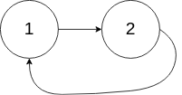

### 141. Linked List Cycle

Given head, the head of a linked list, determine if the linked list has a cycle in it.

There is a cycle in a linked list if there is some node in the list that can be reached again by continuously following the next pointer. Internally, pos is used to denote the index of the node that tail's next pointer is connected to. Note that pos is not passed as a parameter.

Return true if there is a cycle in the linked list. Otherwise, return false.

**Example 1:**


Input: head = [3,2,0,-4], pos = 1  
Output: true  
Explanation: There is a cycle in the linked list, where the tail connects to the 1st node (0-indexed).

**Example 2:**



Input: head = [1,2], pos = 0  
Output: true  
Explanation: There is a cycle in the linked list, where the tail connects to the 0th node.

**Example 3:**


Input: head = [1], pos = -1  
Output: false  
Explanation: There is no cycle in the linked list.

**Constraints:**

* The number of the nodes in the list is in the range [0, 104].
* -105 <= Node.val <= 105
* pos is -1 or a valid index in the linked-list.

Follow up: Can you solve it using O(1) (i.e. constant) memory?

```python
# Definition for singly-linked list.
# class ListNode(object):
#     def __init__(self, x):
#         self.val = x
#         self.next = None

class Solution(object):
    def hasCycle(self, head):
        """
        :type head: ListNode
        :rtype: bool
        """
        #Algorithm = Tortise and Hare (slow and fast)
        #Intituion: if ther is a loop, and fast moves towards slow by two and slow moves away by 1, the net Distance will gets reduced by 1 and eventually the distance become 0

        slow = fast = head

        while fast and fast.next:

            slow = slow.next
            fast = fast.next.next
            if slow == fast:
                return True
        
        return False
```